<h2>Tiled-ImageMask-Dataset-MultipleMyeloma (Updated: 2024/09/07)</h2>

 
This is Tiled-ImageMask Dataset for Multiple Myeloma based on 
<a href="https://segpc-2021.grand-challenge.org/">
Segmentation of Multiple Myeloma Plasma Cells in Microscopic Images (SegPC-2021) 
</a>

 
 
The dataset used here has been taken from kaggle web-site 
<a href="https://www.kaggle.com/datasets/sbilab/segpc2021dataset">
<b>SegPC-2021: Segmentation of Multiple Myeloma Plasma Cells in Microscopic Images</b>
</a>
 
 

<b>Download Tiled-ImageMask-Dataset</b> 
You can download our datasets from the google drive: 

<a href="https://drive.google.com/file/d/105Ppwc5X92_qJhreS1NWUx1-DaCuQd6I/view?usp=sharing">
Tiled-MultipleMyeloma-ImageMask-Dataset.zip</a>
 

 

 
<h3>1. Dataset Citation</h3>
We used the following dataset in kaggle web-site: 
<b>SegPC-2021: Segmentation of Multiple Myeloma Plasma Cells in Microscopic Images</b> 
<a href="https://www.kaggle.com/datasets/sbilab/segpc2021dataset">
https://www.kaggle.com/datasets/sbilab/segpc2021dataset
</a>
  

<b>Citation:</b> 
Anubha Gupta, Ritu Gupta, Shiv Gehlot, Shubham Goswami, April 29, 2021, "SegPC-2021:  
 Segmentation of Multiple Myeloma Plasma Cells  
in Microscopic Images", IEEE Dataport, doi: https://dx.doi.org/10.21227/7np1-2q42. 
BibTex 
@data{segpc2021, 
doi = {10.21227/7np1-2q42}, 
url = {https://dx.doi.org/10.21227/7np1-2q42}, 
author = {Anubha Gupta; Ritu Gupta; Shiv Gehlot; Shubham Goswami }, 
publisher = {IEEE Dataport}, 
title = {SegPC-2021: Segmentation of Multiple Myeloma Plasma Cells in Microscopic Images}, 
year = {2021} } 
IMPORTANT: 
If you use this dataset, please cite below publications- 
1. Anubha Gupta, Rahul Duggal, Shiv Gehlot, Ritu Gupta, Anvit Mangal, Lalit Kumar, Nisarg Thakkar, and Devprakash Satpathy,  
 "GCTI-SN: Geometry-Inspired Chemical and Tissue Invariant Stain Normalization of Microscopic Medical Images,"  
 Medical Image Analysis, vol. 65, Oct 2020. DOI:  
 (2020 IF: 11.148) 
2. Shiv Gehlot, Anubha Gupta and Ritu Gupta,  
 "EDNFC-Net: Convolutional Neural Network with Nested Feature Concatenation for Nuclei-Instance Segmentation," 
 ICASSP 2020 - 2020 IEEE International Conference on Acoustics, Speech and Signal Processing (ICASSP),  
 Barcelona, Spain, 2020, pp. 1389-1393. 
3. Anubha Gupta, Pramit Mallick, Ojaswa Sharma, Ritu Gupta, and Rahul Duggal,  
 "PCSeg: Color model driven probabilistic multiphase level set based tool for plasma cell segmentation in multiple myeloma,"  
 PLoS ONE 13(12): e0207908, Dec 2018. DOI: 10.1371/journal.pone.0207908 
 
<b>License: </b>CC BY-NC-SA 4.0
 
 

<h3>2. Create master dataset</h3>
Please download <a href="https://www.kaggle.com/datasets/sbilab/segpc2021dataset"><b>SegPC-2021: Segmentation of Multiple Myeloma Plasma Cells in Microscopic Images</b></a>, and expand it 
in your working directory. It contains three subsets as shown below.
 

<pre>
./TCIA_SegPC_dataset
├─test
│  └─x
├─train
│  ├─x
│  └─y
└─valid
    ├─x
    └─y
</pre>
Each x in those subsets contains Multiple Myeloma Plasma Cells images files, and y annotations (mask) files
of 2K pixels.
 
<b> train x samples</b>: 
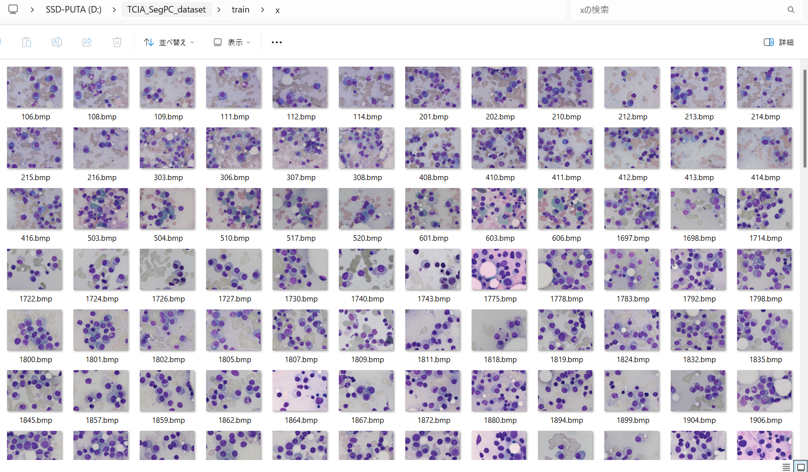  
<b> train y samples</b>: 
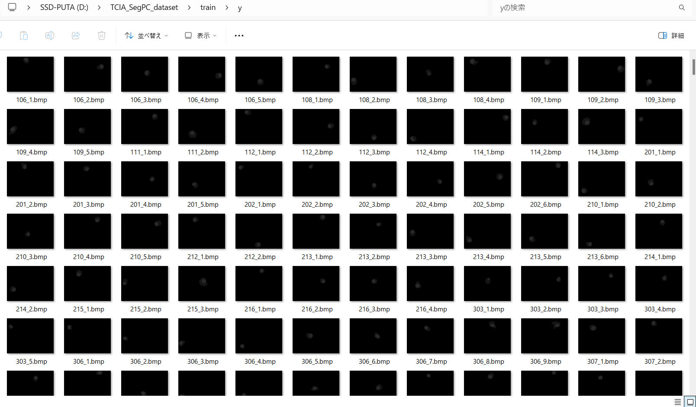  

Please run the following command for Python script <a href="./ImageMaskDatasetGenerator.py">
ImageMaskDatasetGenerator.py
</a> 
<pre>
>python ImageMaskDatasetGenerator.py
</pre>
This generates jpg MultipleMyeloma-master dataset.
<pre>
./MultipleMyeloma-master
├─images
└─masks
</pre>
 

<b>MultipleMyeloma-master/images</b> 
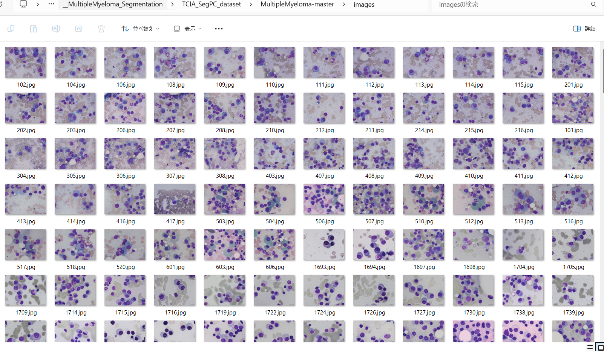  
<b>MultipleMyeloma-master/masks</b> 
  

<h3>3. Create tiled dataset</h3>
Please run the following command for Python script <a href="./TiledImageMaskDatasetGenerator.py">
TiledImageMaskDatasetGenerator.py
</a> 
<pre>
>python TiledImageMaskDatasetGenerator.py
</pre>

This command generates tiledly-splitted 512x512 image and mask files, and size-reduced 512x512 image and mask files 
from MultipleMyeloma-master dataset. 
<pre>
./Tiled-MultipleMyeloma-master
├─images
│  ├─10001.jpg
...
│  └─10497_2x2.jpg
└─masks
    ├─10001.jpg
...    
    └─10497_2x2.jpg
</pre>

For example, an image and mask files of 2560x1920 pixels can be split into a lot of 512x512 tiles as shown below: 

<table>
<tr>
<th>
Image
</th>
<th>
Mask
</th>
</tr>
<tr>
<td>
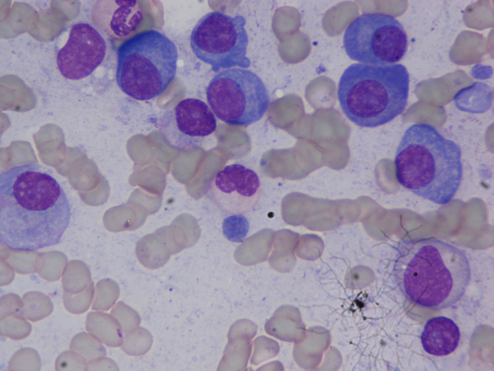
</td>
<td>
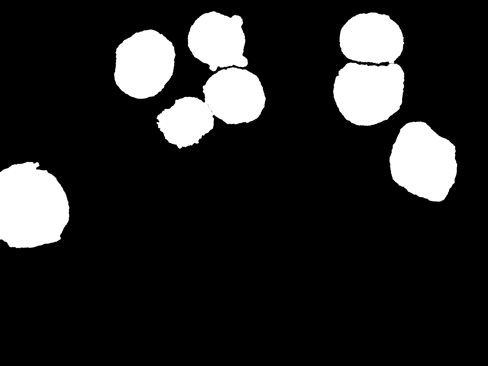

</td>
</tr>
</table>

<table>
<tr>
<th>
Splitted images
</th>
<th>
Splitted masks
</th>
</tr>
<tr>
<td>
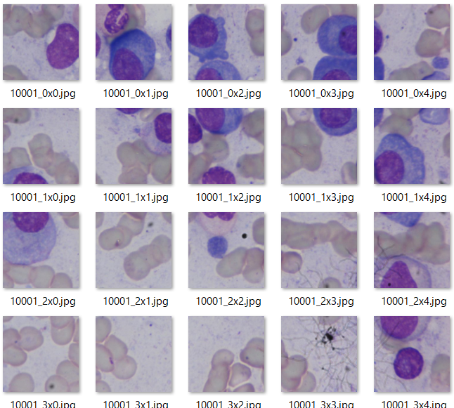

</td>
<td>
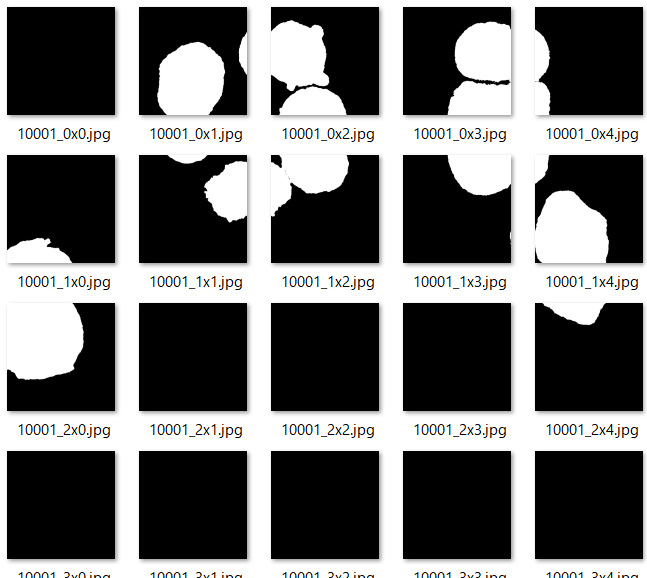

</td>
</tr>

</table>
 
<b>However, since all black only masks are irrelevant annotations, 
we excluded those empty mask tiles and corresponding image tiles to generate our tiled-dataset.</b>
In this case, the splitted images and mask will become the following dataset by applying the exclusion operation.
<table>
<tr>
<th>
Splitted images
</th>
<th>
Splitted masks
</th>
</tr>
<tr>
<td>
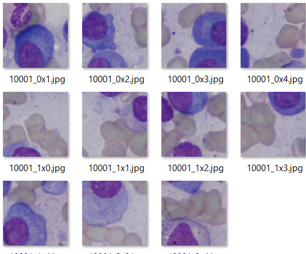

</td>
<td>
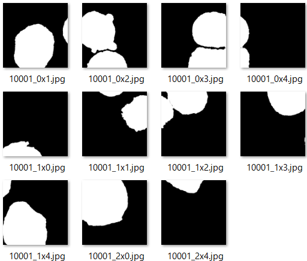

</td>
</tr>

</table>
 

<h3>4. Split tiled dataset</h3>
Please run the following command for Python script <a href="./split_tiled_master.py">
split_tiled_master.py
</a> 
<pre>
>python split_tiled_master.py
</pre>
This command generates Tiled-MultipleMyeloma-ImageMask-Dataset. 
<pre>
./Tiled-MultipleMyeloma-ImageMask-Dataset
├─test
│  ├─images
│  └─masks
├─train
│  ├─images
│  └─masks
└─valid
    ├─images
    └─masks
</pre>

<b>train images: </b> 
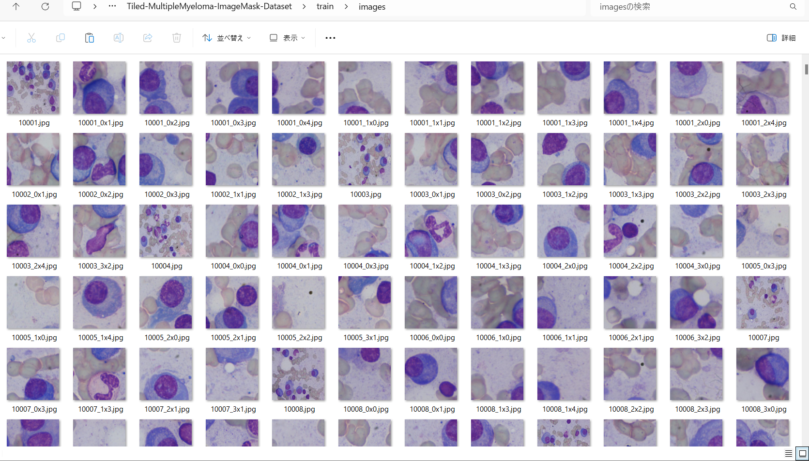
 
<b>train masks: </b> 
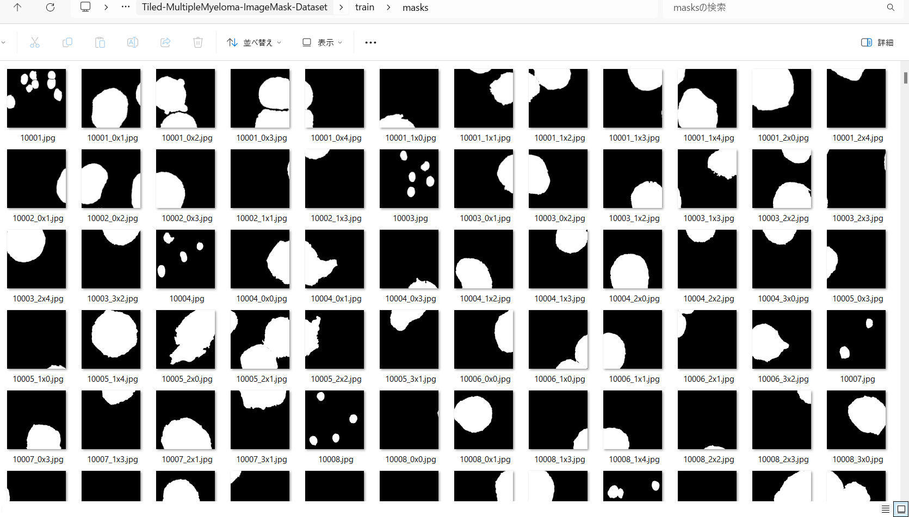

<b>Tiled-MultipleMyeloma-ImageMask-Dataset Statistics</b> 
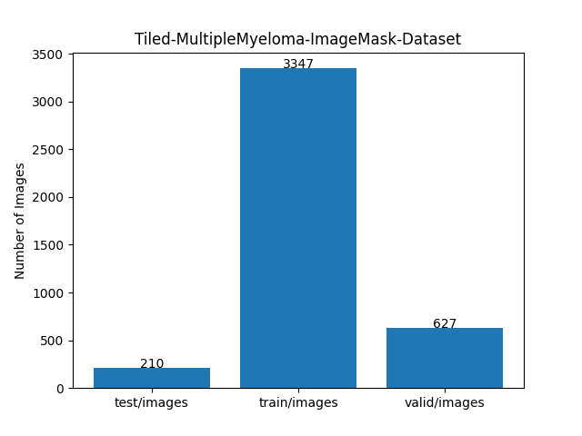 

